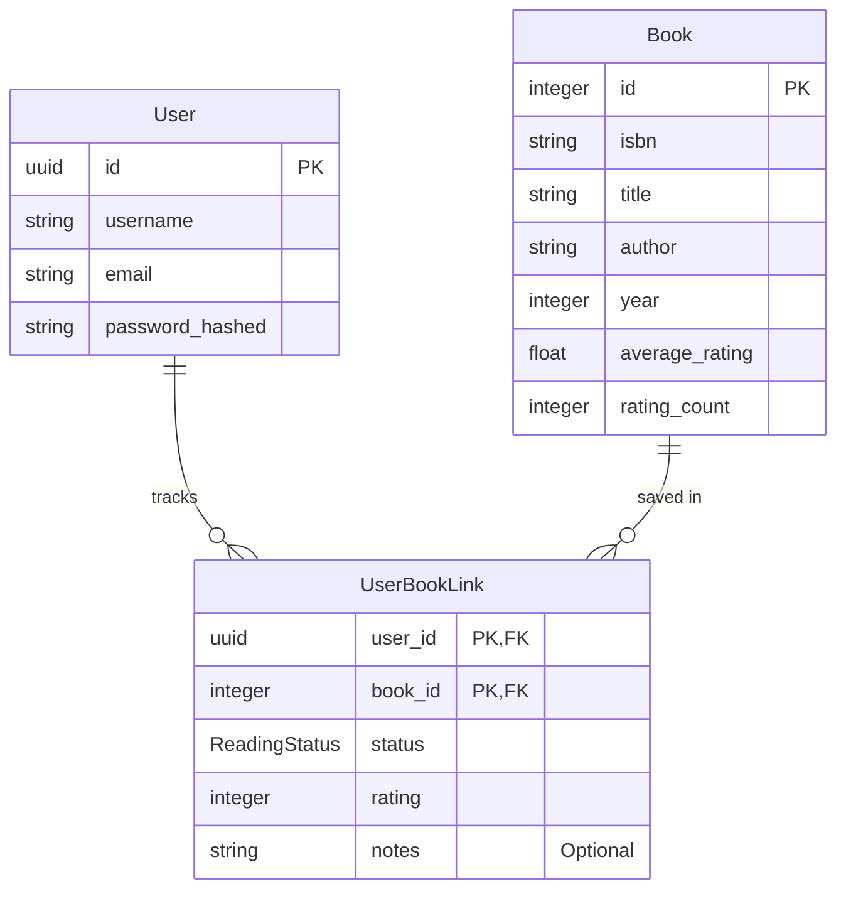

# Book Tracking Backend & Recommendation Engine

This is a production-grade asynchronous backend API and recommendation engine for tracking and discovering books. Built entirely from scratch without any external APIs, pre-trained wrappers, or third-party recommendation services, this project cleans and processes raw interaction data from the Book-Crossing dataset, trains matrix factorization embeddings, and serves secure endpoints, including executing Maximum Inner Product Search (MIPS) on the learned embeddings via FAISS to generate book recommendations using live user library data stored on PostgreSQL (deployed on Neon). The application is dockerized and deployed on Google Cloud Run to provide everything a frontend or mobile developer needs to build a full user-facing application.

Live Interactive API Documentation (Allow a few seconds to boot up): [Swagger UI / OpenAPI Documentation](https://fastapi-service-399898374657.us-east1.run.app/docs)

---

## Tech Stack

* **Framework & Security:** FastAPI, Pydantic, JWT Auth
* **Machine Learning & Vector Engine:** PyTorch (CUDA), Optuna, FAISS-CPU
* **Database & ORM:** PostgreSQL (Neon), SQLAlchemy, Alembic
* **Infrastructure & Deployment:** Docker, Google Cloud Run

---

## How To Test The Documentation

1. Create user endpoint to create a user account:


2. Log in by pressing 'Authorize', using the email as the username:


3. Use the Search endpoint to search a book title and copy the isbn of a selected book:


4. Use the Add Book endpoint to add a book to library, pasting in the book isbn, reading status (must be 'reading' or 'completed' to rate book), and rating (1 - 10):


5. Add several books to your library, and use the Get Library endpoint to view your personal library:


**My Library Includes:**
* *The Fellowship of the Ring (The Lord of the Rings, Part 1)*
* *House Atreides (Dune: House Trilogy, Book 1)*
* *Harry Potter and the Sorcerer's Stone (Book 1)*
* *The Hobbit: The Enchanting Prelude to The Lord of the Rings*
* *A Game of Thrones (A Song of Ice and Fire, Book 1)*
* *A Clash of Kings (A Song of Fire and Ice, Book 2)*

6. Use the Get Recommendations endpoint to generate personalized recommendations. The more content in your library the better the recommendation results:


Result (Personalized recommendations based on my Fantasy preference with a mix of popular items):

```json
[
  {
    "isbn": "0345339738",
    "title": "The Return of the King (The Lord of the Rings, Part 3)",
    "author": "J.R.R. TOLKIEN",
    "year": 1986,
    "average_rating": 9.4,
    "rating_count": 173
  },
  {
    "isbn": "0439136350",
    "title": "Harry Potter and the Prisoner of Azkaban (Book 3)",
    "author": "J. K. Rowling",
    "year": 1999,
    "average_rating": 9,
    "rating_count": 197
  },
  {
    "isbn": "0345339711",
    "title": "The Two Towers (The Lord of the Rings, Part 2)",
    "author": "J.R.R. TOLKIEN",
    "year": 1986,
    "average_rating": 9.1,
    "rating_count": 177
  },
  {
    "isbn": "0385199570",
    "title": "The Stand (The Complete and Uncut Edition)",
    "author": "Stephen King",
    "year": 1990,
    "average_rating": 9,
    "rating_count": 57
  },
// ... 16 additional recommendations truncated for conciseness
]
```

There are additional endpoints to get random books, edit and delete books in user library, and obtain user information.

---

## System Architecture & Data Flow

All dataset processing as well as machine learning model tuning and training were done offline on a CUDA machine before being exported to a FAISS index, which is loaded in memory on API startup.

User actions are handled asynchronously via FastAPI and communicated to a serverless Neon PostgreSQL database. To use the API, users must be authenticated with a valid account, search and view book information (publication year, author, average rating, rating count) across the 5,000+ catalog, and add books to their personal libraries with the book ISBN. The user is able to adjust reading status, ratings, and add private notes on the books in their library. 

The recommendation service pulls the user's library history from PostgreSQL to compile a dynamic user preference vector, and computes precise dot products using the learned book embeddings and biases from the lightweight FAISS index to deliver low-latency and accurate personalized recommendations. 

---

## Database Schema

<div style="max-width: 40%; margin: 0 auto;">



</div>


## Recommendation Engine Architecture

### Final Dataset Statistics

* **Unique Users:** 38,889
* **Unique Books:** 5,381
* **Total Rating Interactions:** 138,103
* **Interaction Matrix Density:** 0.07%

### Loss Function for Training

$$J(w, x, b) = \frac{1}{2} \sum_{(j,i) \in R} \left( w_j \cdot x_i + \mu + b_j + b_i - y^{(j,i)} \right)^2$$

Where:
* $w_j$: Learned 16D latent preference vector for User $j$
* $x_i$: Learned 16D latent feature vector for Book $i$
* $\mu$: Learned global bias from initial global mean rating
* $b_j$: Learned rating bias for User $j$ that captures their rating strictness
* $b_i$: Learned rating bias for Book $i$ that captures item popularity
* $y^{(j,i)}$: Ground truth rating given by User $j$ to Book $i$

$L_2$ Regularization to suppress popularity bias was enforced with PyTorch's `weight_decay` hyperparameter, tuned through my final Optuna study. 

### Strategy for Inference

$$u_{\text{temp}} = \frac{\sum_{i \in \text{history}} w_i \cdot x_i}{\sum_{i \in \text{history}} |w_i| + \epsilon}$$

Where weight $w_i$ for book $i$ is calculated as:

$$w_i = \begin{cases} r_i - 5.0 & \text{if explicitly rated} \\ 2.0 & \text{if unrated} \end{cases}$$

### Dot Product for Cold Start Prediction

$$\hat{y}_{\text{cold}}^{(i)} = 2 \cdot \left( u_{\text{temp}} \cdot x_i \right) + \mu + b^{(i)}$$

Where $2.0$ is the amplifier for weight of books in user history. 

---

## Key Engineering Decisions

### Tradeoff Between Information Density vs. Dataset Size 


This graph shows the x-axis as the number of ratings a book needs to be eligible for inclusion to the training set. Using the "elbow method", it can be seen that filtering books to have at least 3 ratings is where there is a sharp drop in the eligible books (blue line). This is beneficial as it increases the information density in our training set, providing better training results. 

I originally filtered books on 3 ratings, then 5 ratings, but there was still too much noise in the selection of books. My final choice was bumping it up to 10 ratings, and this allowed my Optuna study to return an optimal count of 16 for the embedding dimensions, while increasing my weight decay for $L_2$ regularization to 10x. This was very desirable as I felt the previous weight decays were not strong enough to control the item popularity bias, giving an inflated score to the bias in the dot product and returning mostly popular recommendations rather than targeted ones. This problem was only amplified by the fact that in production I was only running cold start inference for users not in the training set. I did not increase the rating filter further as I wanted a cutoff of at least 5,000 books in my application, as ineligible books must be removed from PostgreSQL as well to prevent "ghost books" that the recommendation model does not recognize. 

### Vector Database for Live Inference

Although my PyTorch inference was already fast (around ~3ms inference latency), I decided to export my inference pipeline to a FAISS vector database to:

* Cut memory overhead of the recommendation model by 150MB.
* Reduce my Docker image size from 8.5GB to 530MB.
* Speed up Docker build compilation time from 10m 17s to 1m 17s.

### Exact MIPS Over ANN or Cosine Similarity

I selected exact MIPS rather than an Approximate Nearest Neighbor technique, and used `IndexFlatIP` to carry out the precise dot products. The magnitude and direction of all my embedding vectors are exactly intact the way my matrix factorization model trained and produced them. I decided to not warp the latent space for a negligible decrease in inference latency, as at around ~3ms, the additional difference would not be recognizable. I also tested using cosine similarity which only measures directional alignment, but preferred a balanced output that includes popularity and novelty achieved through magnitude capture in the dot product.

---

## Challenges Faced

* **DataLoader Tensor Assignment Bug:** Due to a tensor assignment bug in the DataLoader where the user tensor was assigned twice instead of setting an item tensor, my model was learning a latent space for user preferences against user preferences rather than item features. This produced nonsense recommendations despite a deceptively low root mean square error (RMSE), showing how misleading simple metrics can be. This was a source of frustrating debugging, and reset me to the hyper-parameter tuning stage as I had a configuration tuned on an invalid DataLoader.
* **Dominant Item Popularity Bias in Cold-Start Users:** In cold start inference, recommendation results were dominated by popular items as item bias dominated the dot product. To fix this, I had to continuously increase $L_2$ weight decay, condense information density by only training on books with at least 10 ratings, expand the embedding dimensions to 16, and amplify the user history items in the dot product to prioritize personalized recommendations.


---

## Future Production Improvements

* **Remove Dependency on CSV Data:** As I do not have access to data from a production application serving users, I had to settle with training on a CSV dataset.
* **Continuous / Online Retraining Endpoint:** Set up an admin endpoint to trigger continuous or online retraining, allowing inference to use accurately trained user embeddings rather than a compiled user vector from the user's history while implementing safeguards against catastrophic forgetting. 
* **Expanded Feature Collection:** Dedicate more time to feature collection. I dropped many book ISBNs due to missing values; I can instead dedicate time to harvest and complete missing metadata.
* **Running Averages & Live Ingestion Pipelines:** Rather than keeping catalog average ratings static, convert them into running averages calculated from live user ratings. To prevent spam and garbage data, add a buffer to detect anomalies and discard them from model updates.
* **Content-Based & Two-Tower Architecture:** Collaborative filtering especially on cold-start users can only get so far. A more accurate recommendation model can be derived from spending time collecting explicit item features, training through a Two-Tower Network Architecture, and running inference through Approximate Nearest Neighbor (ANN) search rather than precise dot products.
